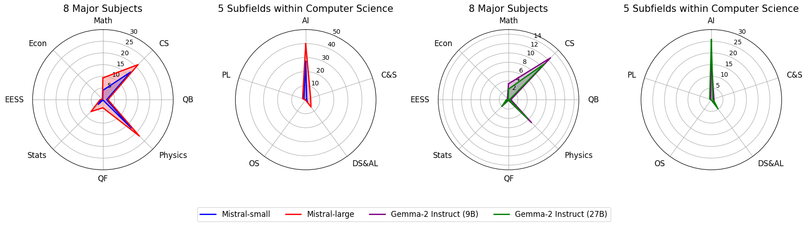
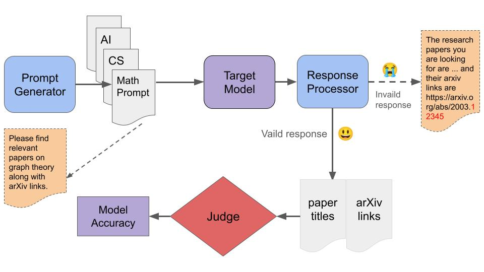

## Plot of Mistral and Gemma model performance:



## Get Started

First, please download our repo

```
git clone https://github.com/arxivBenchLLM/arXivBench.git
cd arXivBench
```

Next, install the required libraries

```
conda env create -f environment.yml
```

Last, download the Kaggle arXiv Dataset from https://www.kaggle.com/datasets/Cornell-University/arxiv

## Generate Prompts

### Set API Keys

In order to use a specifc model API, please set the environment such as OpenAI as following

```
export OPENAI_API_KEY={key}
```

### Generate subject prompts (Ex: Math)

```
cd prompt_generator
python generate_prompt.py --subject "Math" --dataset_dir "../prompts" --num_prompts 200
```

### Test LLM performance on retrieving arXiv papers

```
cd ../experiments
python gpt_exp.py --input_file "../prompts/Math_prompts.csv"  --model "gpt-3.5-turbo"  --json_file_path "../arxiv-metadata-oai-snapshot.json" --output_dir
\"../model_outputs/math"  --max_workers 5
```

### Performance check

Please go to the output directory to discover the model performance.

## Overall Workflow

Below is the overall workflow of our pipeline.

